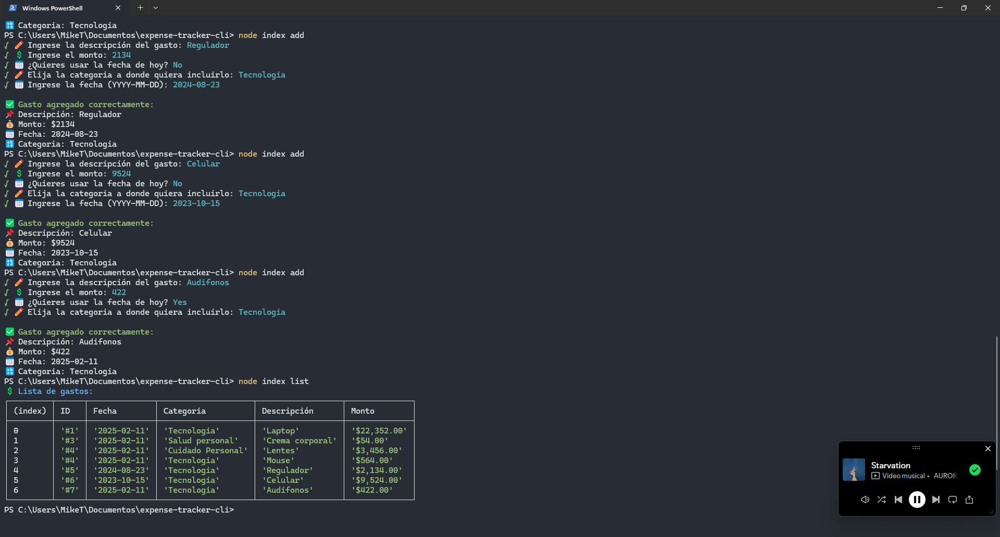

## Description

Build a simple expense tracker application to manage your finances. The application should allow users to add, delete, and view their expenses. The application should also provide a summary of the expenses.

## Table of contents

- [Project link](#project-link)
- [Requirements](#requirements)
- [Implementation](#implementation)
- [Commands](#commands)
- [Usage](#usage)
- [Screenshots](#screenshots)
- [Contact](#contact)

## Project link

[https://roadmap.sh/projects/expense-tracker](https://roadmap.sh/projects/expense-tracker)

## Requirements

Application should run from the command line and should have the following features:

- Users can add an expense with a description and amount.
- Users can update an expense.
- Users can delete an expense.
- Users can view all expenses.
- Users can view a summary of all expenses.
- Users can view a summary of expenses for a specific month (of current year).

Here are some additional features that you can add to the application:

- Add expense categories and allow users to filter expenses by category.
- Allow users to set a budget for each month and show a warning when the user exceeds the budget.
- Allow users to export expenses to a CSV file.

```sh
$ expense-tracker add --description "Lunch" --amount 20
# Expense added successfully (ID: 1)

$ expense-tracker add --description "Dinner" --amount 10
# Expense added successfully (ID: 2)

$ expense-tracker list
# ID  Date       Description  Amount
# 1   2024-08-06  Lunch        $20
# 2   2024-08-06  Dinner       $10

$ expense-tracker summary
# Total expenses: $30

$ expense-tracker delete --id 2
# Expense deleted successfully

$ expense-tracker summary
# Total expenses: $20

$ expense-tracker summary --month 8
# Total expenses for August: $20

```

## Implementation

You can implement the application using any programming language of your choice. Here are some suggestions:

- Use any programming language for any available module for parsing command arguments (e.g. python with the `argparse` , node.js with `commander` etc).
- Use a simple text file to store the expenses data. You can use JSON, CSV, or any other format to store the data.
- Add error handling to handle invalid inputs and edge cases (e.g. negative amounts, non-existent expense IDs, etc).
- Use functions to modularize the code and make it easier to test and maintain.

## Commands

To see the help of which commands are in the CLi to run the application, you can execute:

```sh
node index help
```

These options will be displayed

```sh
 CLI para control de gastos

Options:
  -V, --version   output the version number
  -h, --help      display help for command

Commands:
  list            Muestra el listado de gastos registrados.
  add             Agregar un gasto de manera interactiva.
  edit            Edita un gasto de manera interactiva
  delete          Elimina un gasto de manera interactiva
  summary         Ve un total de todos los montos que se encuentran registrados
  summary-m       Ve un total de todos los montos que se encuentran registrados por mes
  export          Exporta a csv los datos guardados
  import          Exporta a data los datos desde un csv
  limit           Establecer un limite de presupuesto a un mes en especifico
  add-c           Agrega una categoria para un producto o gasto
  list-c          Lista todas las categorias
  edit-c          Edita la categoria de manera interactiva
  delete-c        Elimina la categoria de manera interactiva
  filter-c        Filtra los gastos que hay por categoria
  help [command]  display help for command
```

## Usage

Here are the basic commands to use the expense-tracker-cli

```sh
    node index <Commands>
```

## Screenshots



## Contact

If you have any questions or suggestions, feel free to contact us:

- Author name: [Erick Gonzalez](https://github.com/muke78)
- Email : <erickm.gonzalez.rivera@gmail.com>
